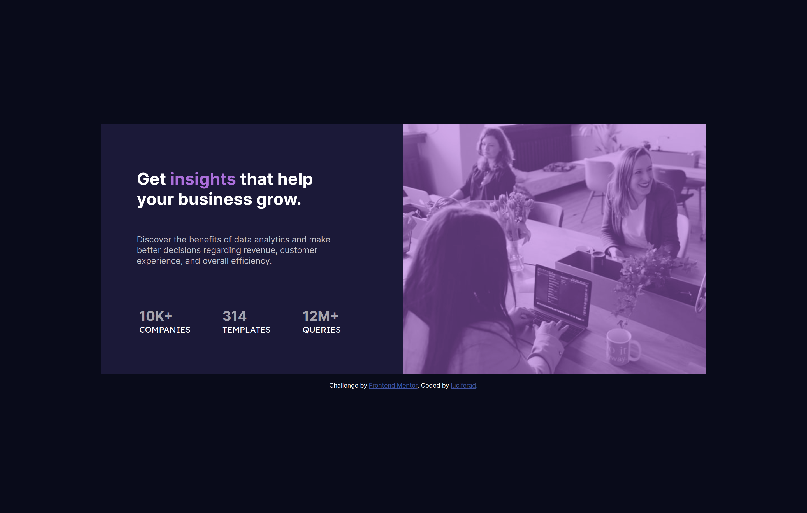

# Frontend Mentor - Stats preview card component solution

This is a solution to the [Stats preview card component challenge on Frontend Mentor](https://www.frontendmentor.io/challenges/stats-preview-card-component-8JqbgoU62). Frontend Mentor challenges help you improve your coding skills by building realistic projects. 

## Table of contents

- [Overview](#overview)
  - [The challenge](#the-challenge)
  - [Screenshot](#screenshot)
  - [Links](#links)
- [My process](#my-process)
  - [Built with](#built-with)
  - [What I learned](#what-i-learned)
  - [Continued development](#continued-development)
  - [Useful resources](#useful-resources)
- [Author](#author)
- [Acknowledgments](#acknowledgments)

## Overview

### The challenge

Users should be able to:

- View the optimal layout depending on their device's screen size

### Screenshot



### Links

- Solution URL: [Github](https://github.com/luciferad/stats-preview-card-component-main)
- Live Site URL: [Github](https://luciferad.github.io/stats-preview-card-component-main/)

## My process

### Built with

- Semantic HTML5 markup
- CSS custom properties
- Flexbox
- CSS Grid

### What I learned

I used 'height: 100vh' in my body selector for using all height of the viewport. But in this project, when I zoom in and zoom out the component, I saw some problem in layout of the component. I figured out that I have to use 'min-height' selector in body selector.

```css
body {
  min-heihgt: 100vh;
}
```

### Continued development

I want to work with Grid & Flexbox. I have to focus on layout, especially in the field of Responsive Web Design. 

### Useful resources

- [Learning Web Design](https://www.amazon.com/Learning-Web-Design-Beginners-JavaScript/dp/1491960205) - This book teaches me everything for begining. It's a good book for starting frontend development.

## Author

- github - [@luciferad](https://github.com/luciferad/)
- Frontend Mentor - [@luciferad](https://www.frontendmentor.io/profile/luciferad)